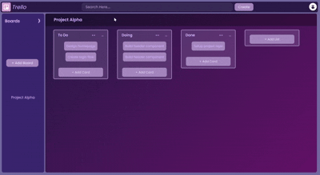

# # Trello Clone 📝

This is a simple **Trello clone** built using **React** and **Redux Toolkit**, allowing users to manage boards, lists, and cards just like in the original Trello.

## ✨ Features

- ✅ **Add Board** — Create new boards to organize your tasks.
- ✅ **Add List** — Inside each board, you can add multiple lists (e.g., To Do, In Progress, Done).
- ✅ **Add Card** — Add tasks/cards inside any list.
- ✅ **Search Boards** — Quickly search and filter boards using the search bar in the header.

## 📁 Project Structure

- `Sidebar` – Displays all boards and option to add a new one.
- `Mainbody` – Shows the selected board with its lists and cards.
- `Header` – Includes the logo, search bar, and a profile icon.
## 📽 Demo Video
 
  

## 🚀 Getting Started

To run the project locally:

```bash
git clone https://github.com/your-username/trelloClone.git
cd trelloClone
npm install
npm start
